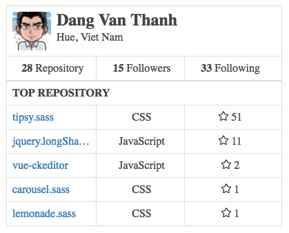

# Vue Github Card

> Github card component using Vue.js



## Usage

### .vue files

```html
<template>
	<github-card user="dangvanthanh"></github-card>
</template>

<script>
import GithubCard from 'GithubCard'

export default {
	components {
		GithubCard
	}
}
</script>
```

### .html files

```html
<!DOCTYPE html>
<html>
<head>
  <meta charset="utf-8">
  <title>Vue Github Card With Vue.js</title>
  <link rel="stylesheet" href="app.css">
</head>
<body>
  <div class="container">
    <github-card username="dangvanthanh"></github-card>
  </div>
  <script src="https://vuejs.org/js/vue.min.js"></script>
  <script>
		var app = new Vue({
		  el: 'body',
		  components: {
		    GithubCard
		  }
		});
	</script>
</body>
</html>
```

## Props

| Props    | Data Type | Required | Description     |
|----------|-----------|----------|-----------------|
| username | String    | false    | Username github |

## License

MIT © [Dang Van Thanh](http://dangthanh.org)
